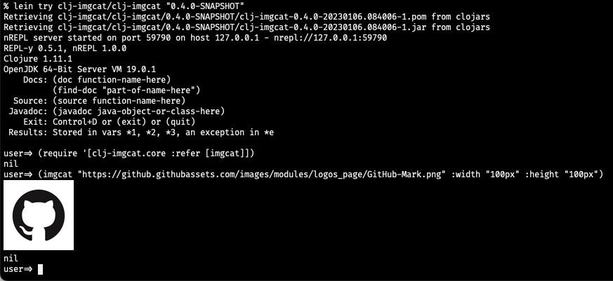

# clj-imgcat

imgcat written in Clojure

Display one or more images in iTerm2 inline. For example:

 

## Installation

Add the following dependency to your `project.clj` file

[](https://clojars.org/clj-imgcat)

## Usage

After launching the REPL in an iTerm window,

```
user=> (require '[clj-imgcat.core :refer [imgcat]])
user=> (imgcat "logo.png")
```
To display remote image,

```
user=> (imgcat "https://clojure.org/images/clojure-logo-120b.png")
```
Specify options,

width and height are given as a number followed by a unit.

```
; N character cells
user=> (imgcat "logo.png" :width 10)

; N pixels
user=> (imgcat "logo.png" :width "50px" :height "100px" :preserveAspectRatio 0)

; N percent of the session's width or height
user=> (imgcat "logo.png" :width "25%")
```
Execute via `lein run`

```
% lein run
Usage: lein run <image file>

% lein run images/logo.png
```

## References

* Inline Images Protocol for iTerm2. [doc](https://www.iterm2.com/documentation-images.html)
* Original sample [code](https://iterm2.com/utilities/imgcat)
* iTerm2's Proprietary Escape Codes [doc](https://iterm2.com/documentation-escape-codes.html)

## License

Copyright (c) 2023 hisaitami

Distributed under the terms of the [MIT License](LICENSE)
